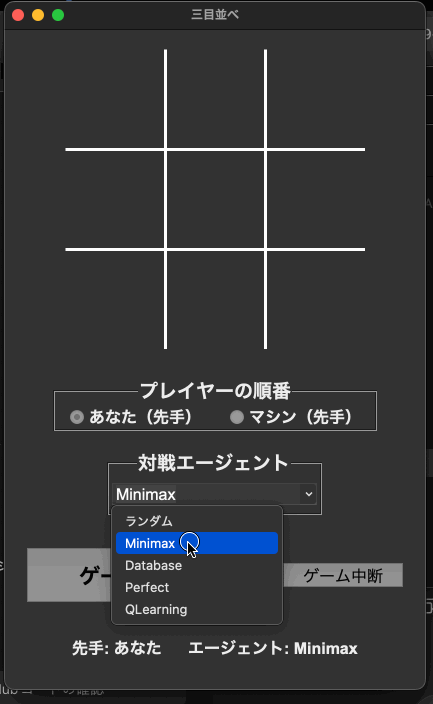

# Tic-Tac-Toe AI Project

これは、様々なAIエージェントで三目並べ（Tic-Tac-Toe）をプレイするためのプロジェクトです。GUIを介して人間がAIと対戦したり、AI同士を対戦させたりすることができます。



## 目次

- [Tic-Tac-Toe AI Project](#tic-tac-toe-ai-project)
  - [目次](#目次)
  - [主なファイルの説明](#主なファイルの説明)
  - [実装されているエージェント](#実装されているエージェント)
  - [使い方](#使い方)
    - [1. GUIアプリケーションの実行](#1-guiアプリケーションの実行)
    - [2. CUI Server/Clientアプリケーションの実行](#2-cui-serverclientアプリケーションの実行)
    - [3. Q学習エージェントの管理 (CLI)](#3-q学習エージェントの管理-cli)
  - [開発者向け情報](#開発者向け情報)
    - [セットアップ](#セットアップ)
    - [テストの実行](#テストの実行)
    - [テストカバレッジの集計](#テストカバレッジの集計)

## 主なファイルの説明

*   `main.py`: アプリケーションのエントリーポイント。GUIを起動します。
*   `gui.py`: メインのGUIウィンドウを構築します。
*   `game_logic.py`: 三目並べのゲームロジック（勝利判定、手番管理など）を担います。
*   `server/server.py`: FastAPIを使用したゲームサーバーの実装。CUIクライアントからのリクエストを処理し、ゲームロジックと連携します。
*   `CUI/client.py`: Server/Clientモデルで三目並べをプレイするためのCUIクライアント。ユーザーからの入力を受け付け、サーバーと通信します。
*   `board_drawer.py`: ゲームボードの描画を担当します。
*   `train_q_learning.py`: Q学習エージェントのモデル（`q_table.json`）を生成するための学習スクリプトです。
*   `verify_q_learning_strength.py`: 学習済みQ学習エージェントの強さを他のAIと比較評価するスクリプトです。
*   `evaluate_models.py`: 2つのQ学習モデル同士を対戦させて優劣を評価するスクリプトです。
*   `create_database.py`: `perfect_agent`が使用する必勝手データベース（`tictactoe.db`）を作成します。

## 実装されているエージェント

`agents/` ディレクトリには、異なるアルゴリズムで動作するAIエージェントが含まれています。

*   `random_agent.py`: ランダムに手を選択する最も基本的なエージェント。
*   `minimax_agent.py`: ミニマックス法を用いて最適な手を探索するエージェント。
*   `q_learning_agent.py`: Q学習によって学習したQテーブルを元に行動を決定するエージェント。
*   `perfect_agent.py`: `perfect_moves.json` または `tictactoe.db` にある必勝手のデータを元に行動するエージェント。
*   `database_agent.py`: データベースに接続して手を決定するエージェントの基盤。

## 使い方

### 1. GUIアプリケーションの実行

以下のコマンドで三目並べのGUIアプリケーションを起動できます。

```bash
python main.py
```

### 2. CUI Server/Clientアプリケーションの実行

Server/Clientモデルで三目並べをCUIでプレイすることができます。

#### 前提条件

このアプリケーションを実行するには、`uvicorn`と`requests`ライブラリが必要です。インストールされていない場合は、以下のコマンドでインストールしてください。

```bash
pip install uvicorn fastapi requests
```

#### サーバーの起動

プロジェクトのルートディレクトリで、以下のコマンドを実行してFastAPIサーバーを起動します。

```bash
uvicorn server.server:app --app-dir . --reload
```
- `--app-dir .`: `server/server.py`が`game_logic.py`を正しくインポートできるように、現在のディレクトリをアプリケーションの検索パスに追加します。
- `--reload`: 開発中にコードが変更された際に、自動的にサーバーを再起動します。

#### クライアントの実行

サーバーが起動したら、**別のターミナル**を開き、プロジェクトのルートディレクトリで以下のコマンドを実行してCUIクライアントを起動します。

```bash
python3 CUI/client.py
```

クライアントアプリケーションは、空いているマスに1から9の数字を表示します。この数字を入力することで、そのマスに手を進めることができます。

### 3. Q学習エージェントの管理 (CLI)

#### Q学習エージェントの学習

`train_q_learning.py` を使ってQ学習エージェントを学習させ、`q_table.json` を生成・更新します。

```bash
# 10万回のエピソードで学習
python train_q_learning.py --episodes 100000

# 既存のQテーブルに追加で5万回学習
python train_q_learning.py --episodes 50000 --continue_training
```

#### Q学習エージェントの強さ評価

`verify_q_learning_strength.py` を使って、学習させたエージェントが他のAI（ランダム、ミニマックス、完全AI）に対してどの程度の強さかを確認できます。

```bash
# 各AIと1000回ずつ対戦して評価
python verify_q_learning_strength.py --num_games 1000
```

#### モデル同士の性能比較

`evaluate_models.py` を使って、2つの異なるQ学習モデル（`.json`ファイル）の性能を直接対決させて比較できます。

```bash
python evaluate_models.py --model1 q_table_A.json --model2 q_table_B.json --num_games 500
```

## 開発者向け情報

### セットアップ

1.  **必勝手データベースの作成（任意）:**
    `perfect_agent` が使用するデータベースを作成します。
    ```bash
    python create_database.py
    ```
    これにより、`tictactoe.db`が生成されます。

### テストの実行

プロジェクトには `pytest` を使ったテストスイートが含まれています。

```bash
# すべてのテストを実行
pytest
```

### テストカバレッジの集計

テストがプロジェクトのコードをどの程度カバーしているかを集計できます。

#### コンソールでの確認

```bash
# カバレッジを計測し、カバーされていない行番号を表示
pytest --cov=. --cov-report=term-missing
```

#### HTMLレポートの生成

より詳細なカバレッジレポートをHTMLファイルとして生成できます。

```bash
# HTMLレポートを生成
pytest --cov=. --cov-report=html

# 生成されたレポートを開く (macOSの場合)
open htmlcov/index.html
```