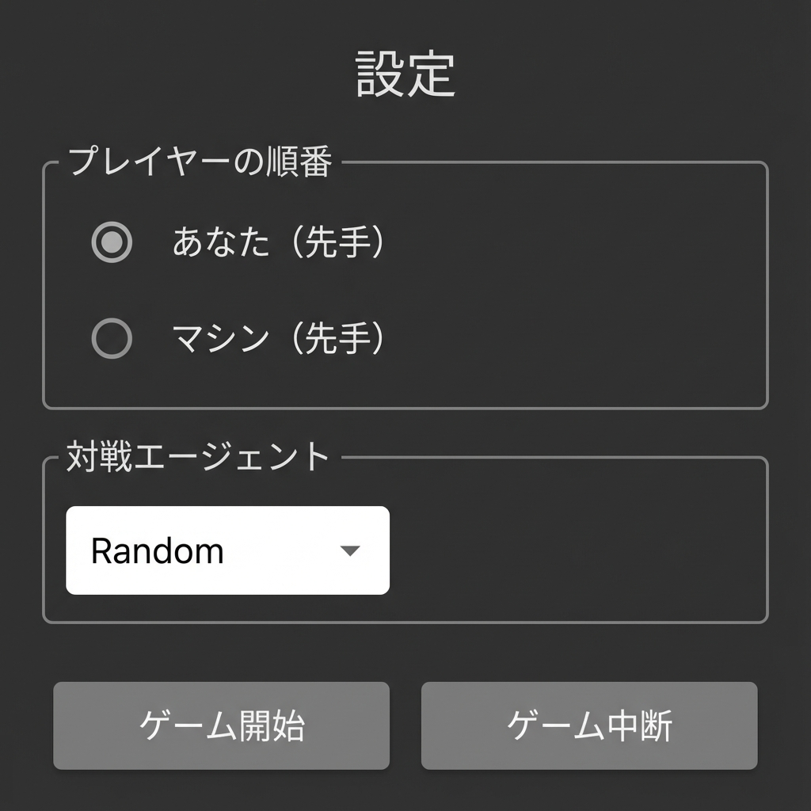
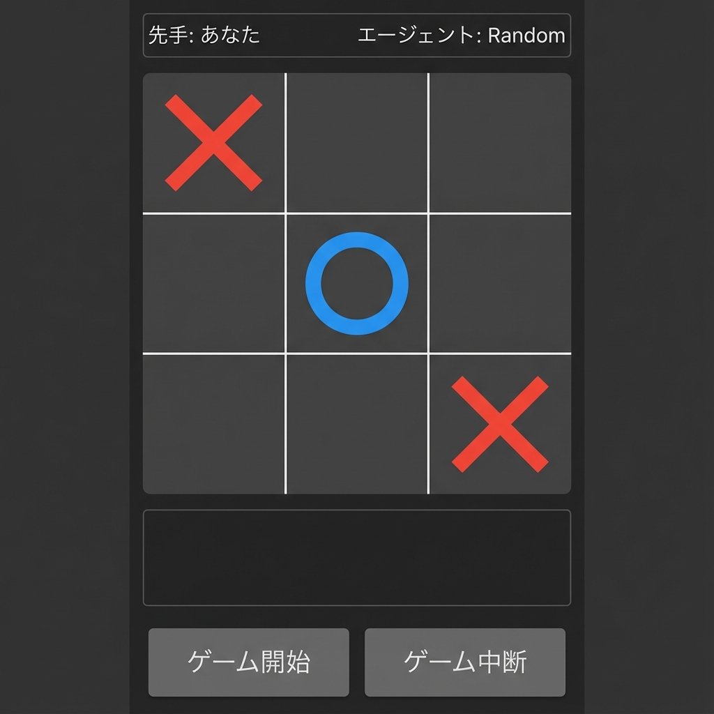
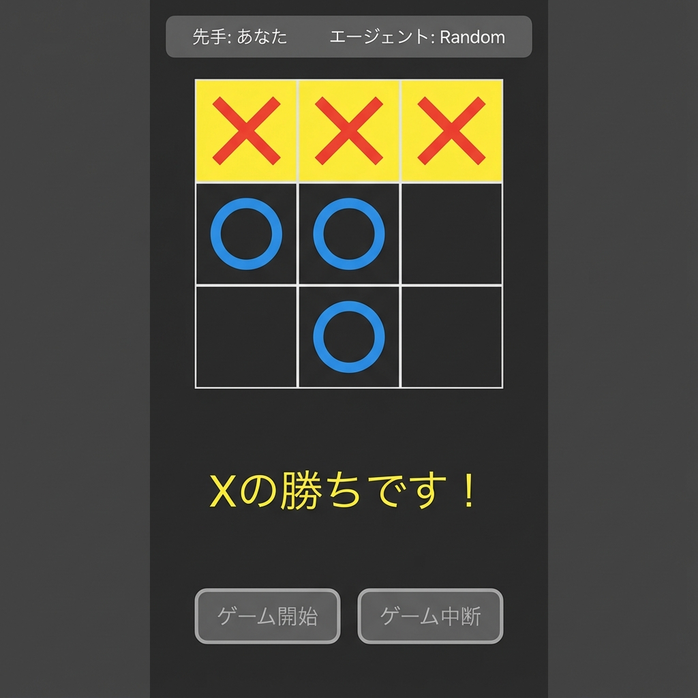

# Flutter Tic-Tac-Toe アプリケーション

Flutter で実装された三目並べ（Tic-Tac-Toe）ゲームアプリケーションです。Python バックエンドサーバーと連携し、様々な AI エージェントと対戦できます。

## 目次

- [Flutter Tic-Tac-Toe アプリケーション](#flutter-tic-tac-toe-アプリケーション)
  - [目次](#目次)
  - [概要](#概要)
  - [スクリーンショット](#スクリーンショット)
    - [設定画面](#設定画面)
    - [ゲーム画面](#ゲーム画面)
    - [ゲーム終了画面](#ゲーム終了画面)
  - [機能](#機能)
  - [アーキテクチャ](#アーキテクチャ)
  - [必要要件](#必要要件)
  - [セットアップ](#セットアップ)
    - [1. Python バックエンドサーバーの起動](#1-python-バックエンドサーバーの起動)
    - [2. Flutter アプリの起動](#2-flutter-アプリの起動)
  - [使い方](#使い方)
  - [テスト](#テスト)
    - [テストの実行](#テストの実行)
    - [カバレッジレポートの生成](#カバレッジレポートの生成)
    - [テスト統計](#テスト統計)
  - [プロジェクト構成](#プロジェクト構成)
    - [ソースコード (`lib/`)](#ソースコード-lib)
    - [テストコード (`test/`)](#テストコード-test)
    - [その他](#その他)
  - [技術スタック](#技術スタック)
  - [ライセンス](#ライセンス)
  - [関連リンク](#関連リンク)

## 概要

このアプリケーションは、Flutter を使用したクロスプラットフォーム対応の三目並べゲームです。Python で実装された AI エージェント（Random、Minimax、Perfect、Q-Learning、Database）と対戦できます。

**主な特徴:**
- シングルスクリーン UI（画面遷移なし）
- ダークテーマデザイン
- Python GUI (`gui.py`) のデザインを忠実に再現
- 100% テストカバレッジ（33テスト）

## スクリーンショット

### 設定画面
プレイヤーの順番と対戦エージェントを選択します。



### ゲーム画面
AI と対戦中の様子です。



### ゲーム終了画面
勝利時には勝利ラインが黄色でハイライトされます。



## 機能

- **プレイヤー選択**: 先手（X）または後手（O）を選択可能
- **AI エージェント選択**: 5種類の AI エージェントから選択
  - Random: ランダムに手を選択
  - Minimax: ミニマックスアルゴリズム
  - Perfect: 完璧な戦略
  - Q-Learning: 強化学習エージェント
  - Database: データベースベースの戦略
- **リアルタイム対戦**: Python バックエンドと HTTP 通信
- **ゲーム状態表示**: 勝敗判定、引き分け表示
- **勝利ラインハイライト**: 3つ並んだマスを黄色で強調表示
- **ゲーム再開**: ゲーム中断・再開機能

## アーキテクチャ

```
Flutter App (UI)
    ↓ HTTP
Python Server (FastAPI)
    ↓
Game Manager
    ↓
AI Agents (Random, Minimax, Perfect, Q-Learning, Database)
```

## 必要要件

- Flutter SDK 3.0 以上
- Dart 3.0 以上
- Python 3.8 以上（バックエンドサーバー用）
- macOS / Windows / Linux（開発環境）

## セットアップ

### 1. Python バックエンドサーバーの起動

```bash
# プロジェクトルートディレクトリで
cd ../../
python -m uvicorn server.server:app --reload
```

サーバーは `http://localhost:8000` で起動します。

### 2. Flutter アプリの起動

```bash
# flutter_tictactoe ディレクトリで
flutter pub get
flutter run -d macos  # macOS の場合
# または
flutter run -d chrome  # Web の場合
```

## 使い方

1. **アプリを起動**
2. **設定画面で選択**:
   - プレイヤーの順番（先手/後手）
   - 対戦エージェント
3. **「ゲーム開始」をクリック**
4. **ゲームプレイ**:
   - 自分の手番でマス目をクリック
   - AI が自動的に応手を打つ
5. **ゲーム終了**:
   - 勝敗が表示される
   - 「ゲーム開始」で再戦
   - 「ゲーム中断」で設定画面に戻る

## テスト

### テストの実行

```bash
flutter test
```

### カバレッジレポートの生成

```bash
flutter test --coverage
genhtml coverage/lcov.info -o coverage/html
open coverage/html/index.html
```

### テスト統計

- **テストカバレッジ**: 100.0% (276/276 lines)
- **テスト数**: 33
- **テストファイル**:
  - `test/models_test.dart` (2.0 KB): データモデルのテスト（2テスト）
  - `test/api_service_test.dart` (3.3 KB): API サービスのテスト（4テスト、エラーハンドリング含む）
  - `test/settings_screen_test.dart` (6.9 KB): 設定画面のウィジェットテスト（8テスト、全オプション・エラー処理）
  - `test/game_screen_test.dart` (8.8 KB): ゲーム画面のウィジェットテスト（13テスト、勝敗・エラー状態含む）
  - `test/game_info_widget_test.dart` (1.2 KB): ゲーム情報表示のテスト（3テスト）
  - `test/main_screen_test.dart` (1.9 KB): 画面切り替えの統合テスト（3テスト）

**ファイル別カバレッジ**:

| ファイル                    | カバレッジ | カバー行数 |
| --------------------------- | ---------- | ---------- |
| `lib/game_info_widget.dart` | 100%       | 11/11      |
| `lib/api_service.dart`      | 100%       | 28/28      |
| `lib/main_screen.dart`      | 100%       | 20/20      |
| `lib/game_screen.dart`      | 100%       | 117/117    |
| `lib/settings_screen.dart`  | 100%       | 76/76      |
| `lib/models.dart`           | 100%       | 24/24      |

## プロジェクト構成

### ソースコード (`lib/`)

```
lib/
├── main.dart                 # アプリケーションエントリーポイント (456 B)
├── main_screen.dart          # メイン画面（状態管理） (1.2 KB)
├── settings_screen.dart      # 設定ウィジェット (6.3 KB)
├── game_screen.dart          # ゲームウィジェット (8.5 KB)
├── game_info_widget.dart     # ゲーム情報表示ウィジェット (1.1 KB)
├── api_service.dart          # API クライアント (1.4 KB)
└── models.dart               # データモデル (1.6 KB)
```

### テストコード (`test/`)

```
test/
├── models_test.dart          # データモデルのユニットテスト (2.0 KB)
├── api_service_test.dart     # API サービスのユニットテスト (3.3 KB)
├── settings_screen_test.dart # 設定画面のウィジェットテスト (6.9 KB, 8テスト)
├── game_screen_test.dart     # ゲーム画面のウィジェットテスト (8.8 KB, 13テスト)
├── game_info_widget_test.dart # ゲーム情報のウィジェットテスト (1.2 KB, 3テスト)
└── main_screen_test.dart     # 画面切り替えの統合テスト (1.9 KB, 3テスト)
```

### その他

```
flutter/
├── images/                   # スクリーンショット
│   ├── settings_screen.png
│   ├── game_screen.png
│   └── game_over_screen.png
└── flutter_tictactoe/
    ├── lib/                  # ソースコード
    ├── test/                 # テストコード
    ├── pubspec.yaml          # 依存関係定義
    └── README.md             # このファイル
```

## 技術スタック

- **フレームワーク**: Flutter 3.x
- **言語**: Dart 3.x
- **状態管理**: StatefulWidget
- **HTTP クライアント**: `http` package
- **テスト**: `flutter_test`, `http/testing`
- **バックエンド**: Python FastAPI
- **通信**: RESTful API (HTTP/JSON)

## ライセンス

このプロジェクトは[MITライセンス](../../LICENSE)の下で公開されています。


## 関連リンク

- [Flutter Documentation](https://docs.flutter.dev/)
- [Dart Documentation](https://dart.dev/guides)
- [FastAPI Documentation](https://fastapi.tiangolo.com/)
