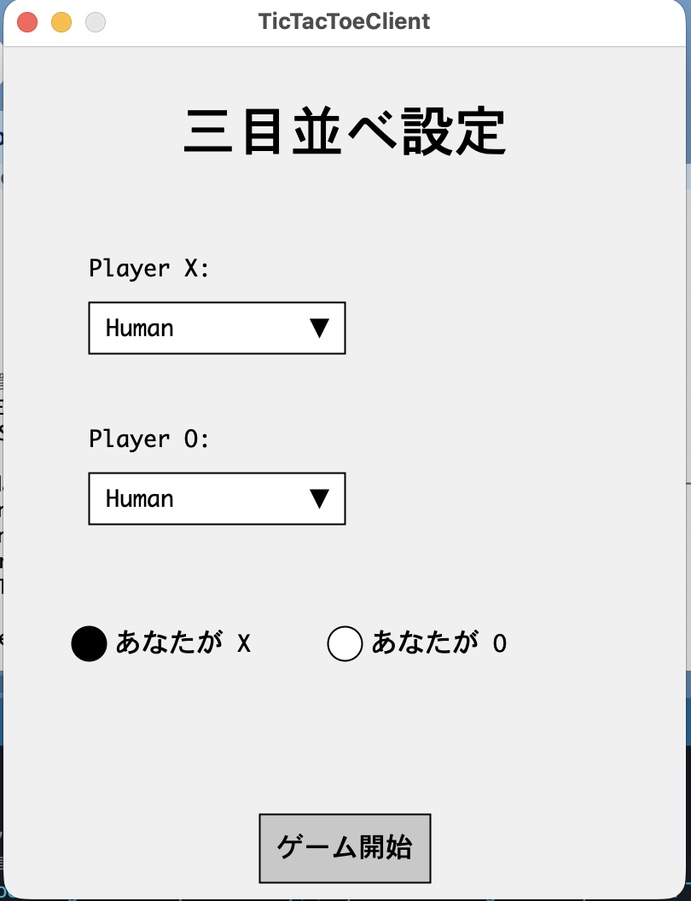
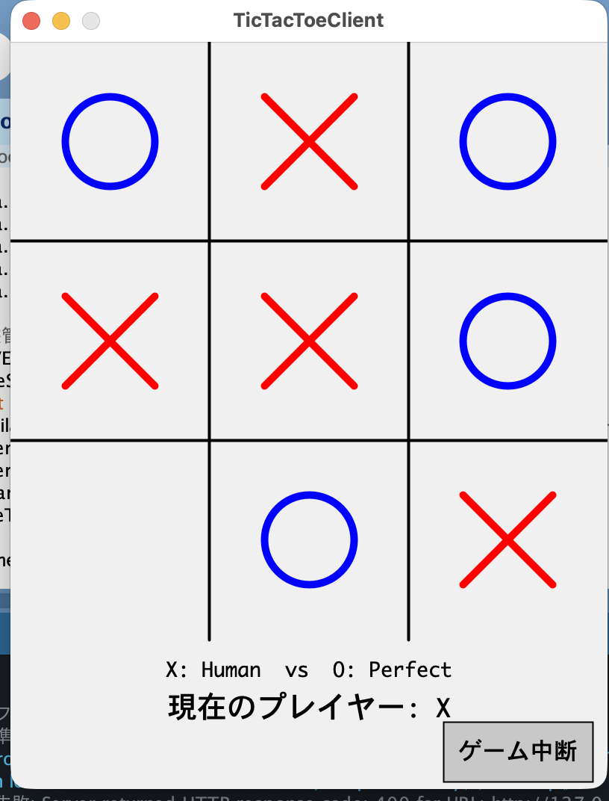
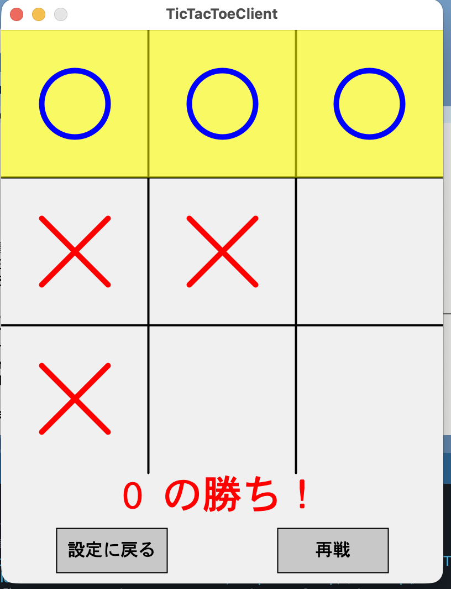

# Tic Tac Toe Client (Processing)

## 概要

このプロジェクトは、Processing で実装された三目並べのクライアントです。ネットワーク経由でゲームサーバーと通信し、グラフィカルユーザーインターフェース (GUI) を通じてユーザーが三目並べをプレイできるようにします。

## 機能

-   **サーバーへの接続**: 指定された IP アドレスとポート番号を使用してゲームサーバーに接続します。
-   **ゲームボードの表示**: 標準的な 3x3 の三目並べボードを表示します。
-   **プレイヤーの移動**: ユーザーがボード上をクリックすることで、駒を配置します。
-   **ゲームの状態表示**: ゲームの進行状況（例: 誰の番か、勝者、引き分け）を GUI 上に表示します。

## 実行方法

Processing 環境がセットアップされていることを前提としています。

1.  Processing IDE をダウンロードしてインストールします（まだの場合）。
    [Processing 公式ウェブサイト](https://processing.org/download/)

2.  `TicTacToeClient.pde` ファイルを Processing IDE で開きます。

3.  コード内の以下の行を、対象のゲームサーバーの IP アドレスとポート番号に合わせて編集します。

    ```processing
    String SERVER_IP = "127.0.0.1"; // サーバーのIPアドレスを設定
    int SERVER_PORT = 12345;      // サーバーのポート番号を設定
    ```

4.  Processing IDE の「実行」ボタン（▶︎）をクリックしてクライアントを起動します。

## 依存関係

-   Processing IDE

## 設定

サーバーの接続設定は、`TicTacToeClient.pde` ファイルの先頭付近にある `SERVER_IP` および `SERVER_PORT` 変数を直接編集することで変更できます。ゲームを開始する前に、これらの値が正しいことを確認してください。

## スクリーンショット

以下はアプリの実行画面の例です。

### 設定画面


### ゲーム中の画面


### ゲーム終了画面

